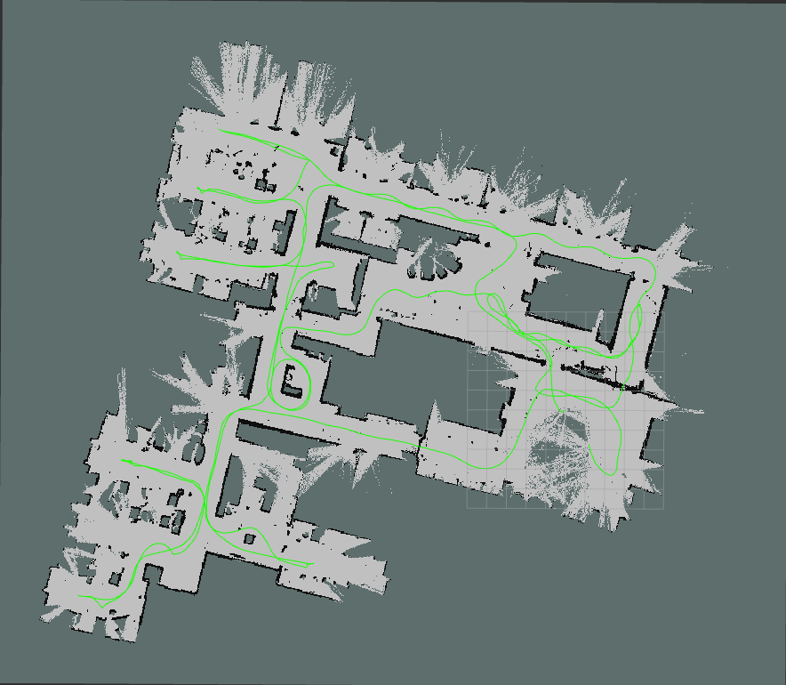

# CSM SLAM

CSM SLAM is a ROS 2 package that implements Simultaneous Localization and Mapping (SLAM) using the Correlative Scan Matcher algorithm as the scan matcher and GTSAM as the backend optimizer. This package provides only offline and Online SLAM capabilities for processing laser scan data and building maps of unknown environments. It is a just barebones implementation where odom and imu are not used for now (Code is inplace for Odometry. However looking for a dataset to test it.).

## How to Run

### Prerequisites
- ROS 2 (Humble or later)
- Python 3

### Build the Package
Create a virtual environment and install the dependencies.
```bash
conda create -n csm_slam python=3.12
conda activate csm_slam
pip install -r requirements.txt
```

Build the package.
```bash
mkdir -p csm_ros_ws/src
cd csm_ros_ws/src
```

Clone the repository in the src folder.

```bash
cd csm_ros_ws
conda activate csm_slam
source /opt/ros/<ros_distro>/setup.bash
colcon build --packages-select csm_slam
source install/setup.bash
```

Adjust the config file to your needs.

### Run Online SLAM
```bash
ros2 launch csm_slam csm_slam.launch.py bag_path:=/path/to/your/rosbag2
```

### Run Offline SLAM
```bash
ros2 launch csm_slam csm_slam_offline.launch.py bag_path:=/path/to/your/rosbag2
```

Both launch files will automatically start RViz2 for visualization

Dataset tested with this package can be found at https://google-cartographer-ros.readthedocs.io/en/latest/demos.html#revo-lds. To download the dataset, run the following command:
```bash
wget -P ~/Downloads https://storage.googleapis.com/cartographer-public-data/bags/revo_lds/cartographer_paper_revo_lds.bag
```

Output of the slam tested in ROS kilted, Ubuntu 24.04 and Conda environment:



If something is not working, please open an issue.

## TODO
- [ ] Add IMU as an option instead of using the odom as an option.
- [ ] Add tests.